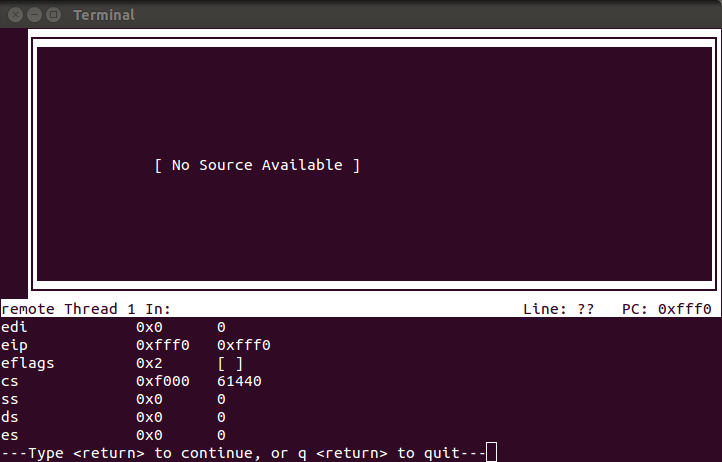
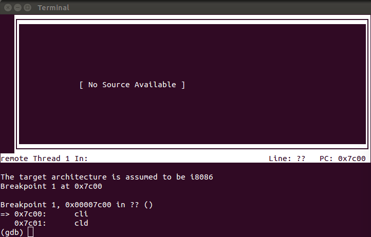
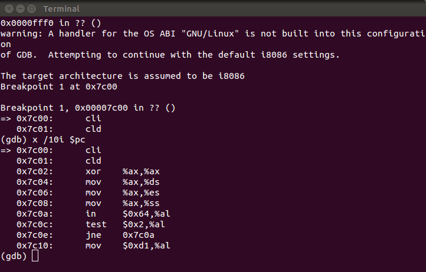
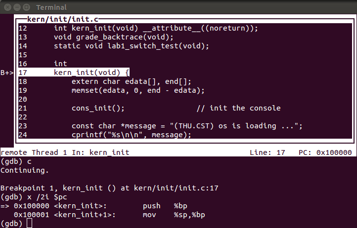
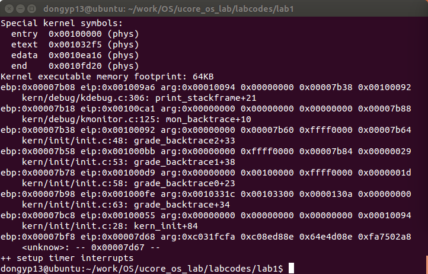

# Lab1 Report

## 练习1：理解通过make生成执行文件的过程
### 练习1.1 操作系统镜像文件ucore.img是如何一步一步生成的？(需要比较详细地解释Makefile中每一条相关命令和命令参数的含义，以及说明命令导致的结果)

在makefile中查找生成ucore.img的代码

```
# create ucore.img
UCOREIMG	:= $(call totarget,ucore.img)

$(UCOREIMG): $(kernel) $(bootblock)
	$(V)dd if=/dev/zero of=$@ count=10000
	$(V)dd if=$(bootblock) of=$@ conv=notrunc
	$(V)dd if=$(kernel) of=$@ seek=1 conv=notrunc

$(call create_target,ucore.img)
```

从中可以看出，为了生成ucore.img，首先需要生成kernel和bootblock

- 生成kernel的代码

```
# create kernel target
kernel = $(call totarget,kernel)

$(kernel): tools/kernel.ld

$(kernel): $(KOBJS)
	@echo + ld $@
	$(V)$(LD) $(LDFLAGS) -T tools/kernel.ld -o $@ $(KOBJS)
	@$(OBJDUMP) -S $@ > $(call asmfile,kernel)
	@$(OBJDUMP) -t $@ | $(SED) '1,/SYMBOL TABLE/d; s/ .* / /; /^$$/d' > $(call symfile,kernel)

$(call create_target,kernel)
```
其中需要的文件有tools/kernel.ld和定义的KOBJS中的包含的.o文件。使用"make V="命令，可以看到执行时使用到了哪些文件。

```
+ ld bin/kernel
ld -m    elf_i386 -nostdlib -T tools/kernel.ld -o bin/kernel  obj/kern/init/init.o obj/kern/libs/readline.o obj/kern/libs/stdio.o obj/kern/debug/kdebug.o obj/kern/debug/kmonitor.o obj/kern/debug/panic.o obj/kern/driver/clock.o obj/kern/driver/console.o obj/kern/driver/intr.o obj/kern/driver/picirq.o obj/kern/trap/trap.o obj/kern/trap/trapentry.o obj/kern/trap/vectors.o obj/kern/mm/pmm.o  obj/libs/printfmt.o obj/libs/string.o
```
其中包括*readline.o; stdio.o; kdebug.o; kmonitor.o; panic.o; clock.o; console.o; intr.o; picirq.o; trap.o; trapentry.o; vectors.o; pmm.o; printfmt.o; string.o*

生成这些文件的makefile代码如下

```
$(call add_files_cc,$(call listf_cc,$(KSRCDIR)),kernel,$(KCFLAGS))
```

实际执行的指令为(以string.o为例)

```
+ cc libs/string.c
gcc -Ilibs/ -fno-builtin -Wall -ggdb -m32 -gstabs -nostdinc  -fno-stack-protector -Ilibs/  -c libs/string.c -o obj/libs/string.o
```
可以看到，通过gcc编译string.c文件生成string.o

- 生成bootblock代码

```
# create bootblock
bootfiles = $(call listf_cc,boot)
$(foreach f,$(bootfiles),$(call cc_compile,$(f),$(CC),$(CFLAGS) -Os -nostdinc))

bootblock = $(call totarget,bootblock)

$(bootblock): $(call toobj,$(bootfiles)) | $(call totarget,sign)
	@echo + ld $@
	$(V)$(LD) $(LDFLAGS) -N -e start -Ttext 0x7C00 $^ -o $(call toobj,bootblock)
	@$(OBJDUMP) -S $(call objfile,bootblock) > $(call asmfile,bootblock)
	@$(OBJCOPY) -S -O binary $(call objfile,bootblock) $(call outfile,bootblock)
	@$(call totarget,sign) $(call outfile,bootblock) $(bootblock)

$(call create_target,bootblock)
```
同样查看实际执行的命令

```
+ ld bin/bootblock
ld -m    elf_i386 -nostdlib -N -e start -Ttext 0x7C00 obj/boot/bootasm.o obj/boot/bootmain.o -o obj/bootblock.o
'obj/bootblock.out' size: 472 bytes
build 512 bytes boot sector: 'bin/bootblock' success!
```
发现用到了bootmain.o和bootasm.o，而且在生成512字节的bootloader时还用到了生成扇区的程序sign。

生成上述文件的命令为

```
+ cc boot/bootasm.S
gcc -Iboot/ -fno-builtin -Wall -ggdb -m32 -gstabs -nostdinc  -fno-stack-protector -Ilibs/ -Os -nostdinc -c boot/bootasm.S -o obj/boot/bootasm.o
+ cc boot/bootmain.c
gcc -Iboot/ -fno-builtin -Wall -ggdb -m32 -gstabs -nostdinc  -fno-stack-protector -Ilibs/ -Os -nostdinc -c boot/bootmain.c -o obj/boot/bootmain.o
+ cc tools/sign.c
gcc -Itools/ -g -Wall -O2 -c tools/sign.c -o obj/sign/tools/sign.o
gcc -g -Wall -O2 obj/sign/tools/sign.o -o bin/sign
```
从gcc的命令中可以看出，由bootasm.S经过编译生成了bootasm.o，由bootmain.c编译生成了bootmain.o，由sign.c生成sign工具。

通过观察make的执行过程，发现makefile中存在很多宏定义的方法，不容易看出实际的编译过程和文件的关联关系，但是通过"make V="指令查看实际编译生成目标文件的指令，比较容易分析。


### 练习1.2：一个被系统认为是符合规范的硬盘主引导扇区的特征是什么？

查看tools/sign.c代码，此代码将bootloader加载到硬盘的主引导扇区中，使得BIOS启动时可以从硬盘中读入bootloader程序，继续执行。sign.c中比较关键的代码如下

```c
buf[510] = 0x55;
buf[511] = 0xAA;
FILE *ofp = fopen(argv[2], "wb+");
size = fwrite(buf, 1, 512, ofp);
if (size != 512) {
    fprintf(stderr, "write '%s' error, size is %d.\n", argv[2], size);
    return -1;
}
fclose(ofp);
```

可见，符合规范的硬盘主引导扇区size=512bytes，并且第511个byte值为0x55，第512个byte的值为0xAA

## 练习2：使用qemu执行并调试lab1中的软件

### 练习2.1：从CPU加电后执行的第一条指令开始，单步跟踪BIOS的执行

修改tools/gdbinit文件，更改后内容为

```
file bin/kernel
target remote :1234
set architecture i8086
```
命令行运行make debug，出现gdb调试窗口，此时的寄存器值为


从中可以看出cs寄存器为0xf000，eip寄存器为0xfff0，即从第一条指令开始执行。并通过si指令进行单步调试。

### 练习2.2：在初始化位置0x7c00设置实地址断点,测试断点正常

在tools/gdbinit文件中继续添加以下指令
```
b *0x7c00
continue
x /2i $pc
```

同样执行make debug，得到的结果如图


### 练习2.3：从0x7c00开始跟踪代码运行,将单步跟踪反汇编得到的代码与bootasm.S和 bootblock.asm进行比较

在0x7c00处输入指令"x /10i pc"查看十条指令


与boot/bootasm.S中的汇编代码对比

```
.code16                                             # Assemble for 16-bit mode
    cli                                             # Disable interrupts
    cld                                             # String operations increment

    # Set up the important data segment registers (DS, ES, SS).
    xorw %ax, %ax                                   # Segment number zero
    movw %ax, %ds                                   # -> Data Segment
    movw %ax, %es                                   # -> Extra Segment
    movw %ax, %ss                                   # -> Stack Segment

    # Enable A20:
    #  For backwards compatibility with the earliest PCs, physical
    #  address line 20 is tied low, so that addresses higher than
    #  1MB wrap around to zero by default. This code undoes this.
seta20.1:
    inb $0x64, %al                                  # Wait for not busy(8042 input buffer empty).
    testb $0x2, %al
    jnz seta20.1

    movb $0xd1, %al                                 # 0xd1 -> port 0x64
 
```
可以看到，代码一致！

###练习2.4：自己找一个bootloader或内核中的代码位置，设置断点并进行测试

在tools/gdbinit中加入指令"break kern\_init"，运行make debug，得到的结果如图


可以看到，程序在kern_init入口处停止，可以通过si命令单步调试。

## 练习3：分析bootloader进入保护模式的过程
从练习2可知，BIOS启动后加载bootloader到0x7c00地址，并且对应的代码为boot/bootasm.S中汇编码，以下分析此段汇编代码。

- 首先进行初始化操作，关中断并且将段寄存器置零

```
cli                                             # Disable interrupts
cld                                             # String operations increment

#Set up the important data segment registers (DS, ES, SS).
xorw %ax, %ax                                   # Segment number zero
movw %ax, %ds                                   # -> Data Segment
movw %ax, %es                                   # -> Extra Segment
movw %ax, %ss                                   # -> Stack Segment
```

- 开启A20，使用8042键盘控制器控制A20，这样为切换到保护模式做好准备，使得32位地址线全部可用

```
    # Enable A20:
    #  For backwards compatibility with the earliest PCs, physical
    #  address line 20 is tied low, so that addresses higher than
    #  1MB wrap around to zero by default. This code undoes this.
seta20.1:
    inb $0x64, %al                                  # Wait for not busy(8042 input buffer empty).
    testb $0x2, %al
    jnz seta20.1

    movb $0xd1, %al                                 # 0xd1 -> port 0x64
    outb %al, $0x64                                 # 0xd1 means: write data to 8042's P2 port

seta20.2:
    inb $0x64, %al                                  # Wait for not busy(8042 input buffer empty).
    testb $0x2, %al
    jnz seta20.2

    movb $0xdf, %al                                 # 0xdf -> port 0x60
    outb %al, $0x60                                 # 0xdf = 11011111, means set P2's A20 bit(the 1 bit) to 1
```
- 加载全局描述符寄存器gdtr，通过lgdt指令将全局描述符入口地址装入gdtr寄存器中

```
lgdt gdtdesc
```

- 进入保护模式，将CR0寄存器最低位PE置1

```
movl %cr0, %eax
orl $CR0_PE_ON, %eax
movl %eax, %cr0
```

- 更新cs段寄存器，并通过长跳转指令使用保护模式的寻址方式

```
ljmp $PROT_MODE_CSEG, $protcseg
```

- 设置段寄存器与栈帧地址，进入bootmain继续执行

```
.code32                                             # Assemble for 32-bit mode
protcseg:
    # Set up the protected-mode data segment registers
    movw $PROT_MODE_DSEG, %ax                       # Our data segment selector
    movw %ax, %ds                                   # -> DS: Data Segment
    movw %ax, %es                                   # -> ES: Extra Segment
    movw %ax, %fs                                   # -> FS
    movw %ax, %gs                                   # -> GS
    movw %ax, %ss                                   # -> SS: Stack Segment

    # Set up the stack pointer and call into C. The stack region is from 0--start(0x7c00)
    movl $0x0, %ebp
    movl $start, %esp
    call bootmain
```

## 练习4：分析bootloader加载ELF格式的OS的过程

- readsect函数，用于加载一个扇区的内容到指定的内存中，读取的过程大致为：(1)等待磁盘准备好；(2)发出读取扇区的命令，通过访问IO地址寄存器0x1f0~0x1f7实现；(3)等待磁盘准备好；(4)把磁盘扇区读取到指定内存中。具体代码如下：

```c
static void readsect(void *dst, uint32_t secno) {
    // wait for disk to be ready
    waitdisk();

    outb(0x1F2, 1);                         // count = 1
    outb(0x1F3, secno & 0xFF);
    outb(0x1F4, (secno >> 8) & 0xFF);
    outb(0x1F5, (secno >> 16) & 0xFF);
    outb(0x1F6, ((secno >> 24) & 0xF) | 0xE0);
    outb(0x1F7, 0x20);                      // cmd 0x20 - read sectors

    // wait for disk to be ready
    waitdisk();

    // read a sector
    insl(0x1F0, dst, SECTSIZE / 4);
}
```

- readseg函数，这个函数的作用是从ELF文件偏移为offset处，读取count个字节到内存地址为pa处，实现如下

```c
static void readseg(uintptr_t va, uint32_t count, uint32_t offset) {
    uintptr_t end_va = va + count;

    // round down to sector boundary
    va -= offset % SECTSIZE;

    // translate from bytes to sectors; kernel starts at sector 1
    uint32_t secno = (offset / SECTSIZE) + 1;

    // If this is too slow, we could read lots of sectors at a time.
    // We'd write more to memory than asked, but it doesn't matter --
    // we load in increasing order.
    for (; va < end_va; va += SECTSIZE, secno ++) {
        readsect((void *)va, secno);
    }
}
```

- bootmain函数，首先将硬盘上从第一个扇区开始的4096个字节读到内存中地址为0x10000处，然后检查ELF文件是否合法，并找到程序段的起始地址，读取内核程序到内存中，最后执行内核程序，实现代码如下

```c
void bootmain(void) {
    // read the 1st page off disk
    readseg((uintptr_t)ELFHDR, SECTSIZE * 8, 0);

    // is this a valid ELF?
    if (ELFHDR->e_magic != ELF_MAGIC) {
        goto bad;
    }

    struct proghdr *ph, *eph;

    // load each program segment (ignores ph flags)
    ph = (struct proghdr *)((uintptr_t)ELFHDR + ELFHDR->e_phoff);
    eph = ph + ELFHDR->e_phnum;
    for (; ph < eph; ph ++) {
        readseg(ph->p_va & 0xFFFFFF, ph->p_memsz, ph->p_offset);
    }

    // call the entry point from the ELF header
    // note: does not return
    ((void (*)(void))(ELFHDR->e_entry & 0xFFFFFF))();

bad:
    outw(0x8A00, 0x8A00);
    outw(0x8A00, 0x8E00);

    /* do nothing */
    while (1);
}
```

其中elfhdr、proghdr格式在elf.h中定义。

## 练习5：实现函数调用堆栈跟踪函数
在kern/kdebug.c中实现print_stackframe函数

```
void
print_stackframe(void) {
     /* LAB1 YOUR CODE : STEP 1 */
     /* (1) call read_ebp() to get the value of ebp. the type is (uint32_t);
      * (2) call read_eip() to get the value of eip. the type is (uint32_t);
      * (3) from 0 .. STACKFRAME_DEPTH
      *    (3.1) printf value of ebp, eip
      *    (3.2) (uint32_t)calling arguments [0..4] = the contents in address (unit32_t)ebp +2 [0..4]
      *    (3.3) cprintf("\n");
      *    (3.4) call print_debuginfo(eip-1) to print the C calling function name and line number, etc.
      *    (3.5) popup a calling stackframe
      *           NOTICE: the calling funciton's return addr eip  = ss:[ebp+4]
      *                   the calling funciton's ebp = ss:[ebp]
      */
	uint32_t ebp = read_ebp();
	uint32_t eip = read_eip();
	int i, j;
	for(i = 0; i < STACKFRAME_DEPTH && ebp != 0; i++) {
		cprintf("ebp:0x%08x eip:0x%08x", ebp, eip);
		uint32_t *arg = (uint32_t *)ebp + 2;
		cprintf(" arg:");
		for(j = 0; j < 4; j++) {
			cprintf("0x%08x ", arg[j]);
		}
		cprintf("\n");
		print_debuginfo(eip - 1);
		eip = ((uint32_t *)ebp)[1];
		ebp = ((uint32_t*)ebp)[0];
	}
}
```
程序运行的结果如图



最后一行输出的ebp为0x00007bf8，eip为0x00007d68，这时因为bootloader被加载到了0x00007c00地址处，在执行到bootasm最后"call bootmain"指令时，首先将返回地址压栈，再讲当前ebp压栈，所以此时esp为0x00007bf8。在bootmain函数入口处，有mov %esp %ebp指令，故bootmain中ebp为0x00007bf8。

## 练习6：完善中断初始化和处理
### 练习6.1：中断描述符表（也可简称为保护模式下的中断向量表）中一个表项占多少字节？其中哪几位代表中断处理代码的入口？

中断描述符表中一个表项占8字节，具体的定义在kern/mm/mmu.h中

```c
/* Gate descriptors for interrupts and traps */
struct gatedesc {
    unsigned gd_off_15_0 : 16;        // low 16 bits of offset in segment
    unsigned gd_ss : 16;            // segment selector
    unsigned gd_args : 5;            // # args, 0 for interrupt/trap gates
    unsigned gd_rsv1 : 3;            // reserved(should be zero I guess)
    unsigned gd_type : 4;            // type(STS_{TG,IG32,TG32})
    unsigned gd_s : 1;                // must be 0 (system)
    unsigned gd_dpl : 2;            // descriptor(meaning new) privilege level
    unsigned gd_p : 1;                // Present
    unsigned gd_off_31_16 : 16;        // high bits of offset in segment
};
```
从中可以看出，中断处理代码的入口为0~1字节和6~7字节组成的地址。

### 练习6.2：请编程完善kern/trap/trap.c中对中断向量表进行初始化的函数idt\_init。在idt\_init函数中，依次对所有中断入口进行初始化。使用mmu.h中的SETGATE宏，填充idt数组内容。每个中断的入口由tools/vectors.c生成，使用trap.c中声明的vectors数组即可。

在函数idt\_init中增加代码如下：

```c
	extern uintptr_t __vectors[];
	int i;
	for(i = 0; i < 256; i++) {
		SETGATE(idt[i], 0, GD_KTEXT, __vectors[i], DPL_KERNEL);
	}
	SETGATE(idt[T_SWITCH_TOK], 0, GD_KTEXT, __vectors[T_SWITCH_TOK], DPL_USER);
	lidt(&idt_pd);
```

### 练习6.3：请编程完善trap.c中的中断处理函数trap，在对时钟中断进行处理的部分填写trap函数中处理时钟中断的部分，使操作系统每遇到100次时钟中断后，调用print_ticks子程序，向屏幕上打印一行文字”100 ticks”。

在trap\_dispatch中增加代码如下：

```c
	case IRQ_OFFSET + IRQ_TIMER:
        /* LAB1 YOUR CODE : STEP 3 */
        /* handle the timer interrupt */
        /* (1) After a timer interrupt, you should record this event using a global variable (increase it), such as ticks in kern/driver/clock.c
         * (2) Every TICK_NUM cycle, you can print some info using a funciton, such as print_ticks().
         * (3) Too Simple? Yes, I think so!
         */
    	ticks++;
    	if (ticks % TICK_NUM == 0) {
    		print_ticks();
    	}
        break;
```

## 与标准答案的差异
在练习6.2中idt_init函数中，我的答案为：

```c
for(i = 0; i < 256; i++) {
    SETGATE(idt[i], 0, GD_KTEXT, __vectors[i], DPL_KERNEL);
}
```
标准答案为：

```c
for (i = 0; i < sizeof(idt) / sizeof(struct gatedesc); i ++) {
    SETGATE(idt[i], 0, GD_KTEXT, __vectors[i], DPL_KERNEL);
}
```

从中可以看出，由于之前申明的idt数组有256项，所以我直接使用了256，但是相比于答案鲁棒性有所差距。

## 本实验中重要的知识点
1. makefile的写法
2. gdb调试工具的使用
3. 开机启动的过程，从BIOS加载bootloader再加载ucore内核的过程
4. ucore中对中断的支持

## 列出你认为OS原理中很重要，但在实验中没有对应上的知识点
1. 系统异常对应的处理
2. 中断描述表中各位代表的具体含义以及如何使用
